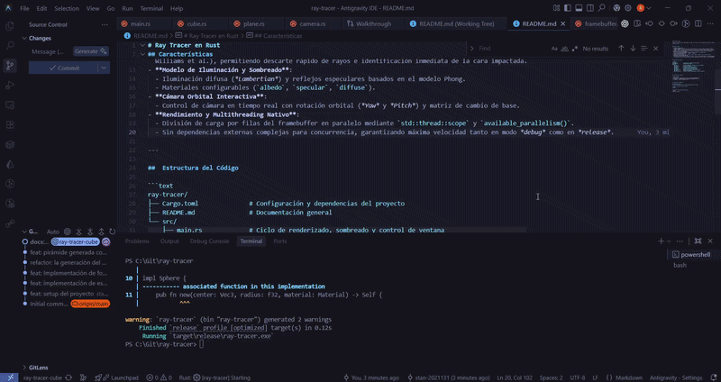

# Ray Tracer en Rust 

Un motor de trazado de rayos (*Ray Tracer*) en tiempo real escrito en Rust con renderizado interactivo, iluminación Phong y aceleración multihilo nativa.



---

## Características

- **Primitivas Geométricas**:
  - **Esfera (`Sphere`)**: Intersección analítica rayo-esfera con cálculo de normales y distancias exactas.
  - **Plano (`Plane`)**: Rectángulo finito ajustable y orientable en el espacio 3D mediante vectores normales y base ortonormal precalculada.
  - **Cubo (`Cube`)**: Implementación ultra eficiente de caja alineada a los ejes (AABB) mediante el algoritmo **Slab Method** (Kay-Kajiya / Williams et al.), permitiendo descarte rápido de rayos e identificación inmediata de la cara impactada.
- **Mapeo de Texturas UV Reutilizable**:
  - Soporte de texturas de imagen externa (PNG, JPG) integrado en `Material`.
  - Muestreo UV con *wrapping* seguro en las 6 caras del cubo, planos rectangulares y esferas.
  - Sistema de *fallback* automático: si una imagen no se encuentra, genera una textura placeholder en memoria sin interrumpir la ejecución.
- **Modelo de Iluminación y Sombreado**:
  - Iluminación difusa (*Lambertian*) y reflejos especulares basados en el modelo Phong.
  - Materiales configurables (`albedo`, `specular`, `diffuse`, `texture`).
- **Cámara Orbital Interactiva**:
  - Control de cámara en tiempo real con rotación orbital (*Yaw* y *Pitch*) y matriz de cambio de base.
- **Rendimiento y Multithreading Nativo**:
  - División de carga por filas del framebuffer en paralelo mediante `std::thread::scope` y `available_parallelism()`.
  - Sin dependencias externas complejas para concurrencia, garantizando máxima velocidad tanto en modo *debug* como en *release*.

---

## Estructura del Código

```text
ray-tracer/
├── Cargo.toml              # Configuración y dependencias del proyecto
├── README.md               # Documentación general
├── textures/               # Carpeta para texturas de imagen (PNG, JPG)
└── src/
    ├── main.rs             # Ciclo de renderizado, sombreado y control de ventana
    ├── sphere.rs           # Primitiva de Esfera con mapeo UV esférico
    ├── plane.rs            # Primitiva de Plano finito ajustable con UV planar
    ├── cube.rs             # Primitiva de Cubo (Slab Method) con UV cúbico
    ├── texture.rs          # Carga de texturas con `image` y muestreo UV
    ├── camera.rs           # Cámara, matriz de proyección y órbita
    ├── color.rs            # Manejo de colores RGB y conversiones
    ├── framebuffer.rs      # Buffer de pantalla y manipulación de píxeles
    ├── light.rs            # Fuentes de luz puntual
    └── ray_intersect.rs    # Traits e interfaces (RayIntersect, Material, Intersect)
```

---

## 🎨 Sistema de Texturizado

El motor cuenta con un sistema desacoplado de texturas que permite aplicar imágenes a cualquier objeto de la escena:

```rust
use std::sync::Arc;
use crate::texture::Texture;
use crate::ray_intersect::Material;

// 1. Cargar la textura (PNG / JPG)
let texture = Arc::new(Texture::new("./textures/wall.png"));

// 2. Crear material texturizado
let textured_mat = Material::new_with_texture(
    Color::new(255, 255, 255), // Tinte base
    50.0,                       // Especular
    [0.8, 0.2],                 // Albedo [difuso, especular]
    texture,
);

// 3. Asignar al cubo u otra forma geométrica
let cube = Cube::new(center, size, textured_mat);
```

---

## Controles de la Ventana

| Tecla | Acción |
| :--- | :--- |
| **$\leftarrow$ / $\rightarrow$** | Rotar cámara horizontalmente (Yaw) |
| **$\uparrow$ / $\downarrow$** | Rotar cámara verticalmente (Pitch) |
| **`Escape`** | Cerrar la ventana / Salir |

---

## Compilación y Ejecución

### Requisitos Previos
* [Rust y Cargo](https://www.rust-lang.org/tools/install) instalados.

### Ejecutar en Modo Desarrollo (Debug)
```bash
cargo run
```

### Ejecutar en Modo Optimizado (Release)
```bash
cargo run --release
```